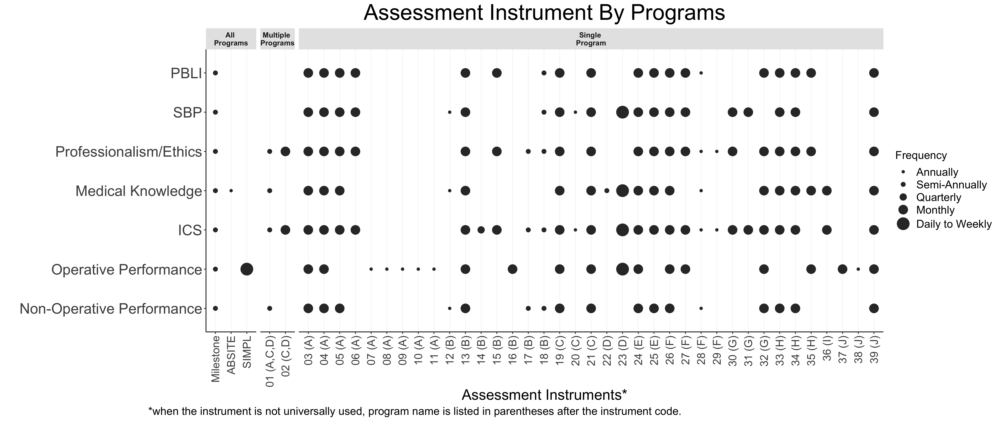

In 2022, I have made charts for manuscript publications, abstracts, posters, podium presentations, executive reports, etc. My audiences were mostly hospital administratives, healthcare providers, and academic researchers. Here are some of the most interesting — and simple, complex, and colorful — charts I made. 

## Rates Distribution

The plot demonstrates the wide distribution of cesarean rates among Michigan hospitals. The target rate reference line was used to show high vs. low performing hospitals. 

## Performance Improvement 

This plot shows the hospitals with improved performance from 2021 to 2022. Since hospital sizes vary, I highlighted the high volume hospitals to put emphasize on them.

## Ripening Path ways

During the induction of labor processes, many pathways combinations can happen. It is still mostly unknown to our practitioners what pathways lead to lower risk of cesarean. The plot demonstrated the complexity of the processes.

## Assessment tools

In surgical residency, there are a huge range of assessment tools each program uses. Most of assessments are just used in a single program. In the plot, Y axis is the area the instruments were designed to assess; x axis is the name of the assessment instrument. 

