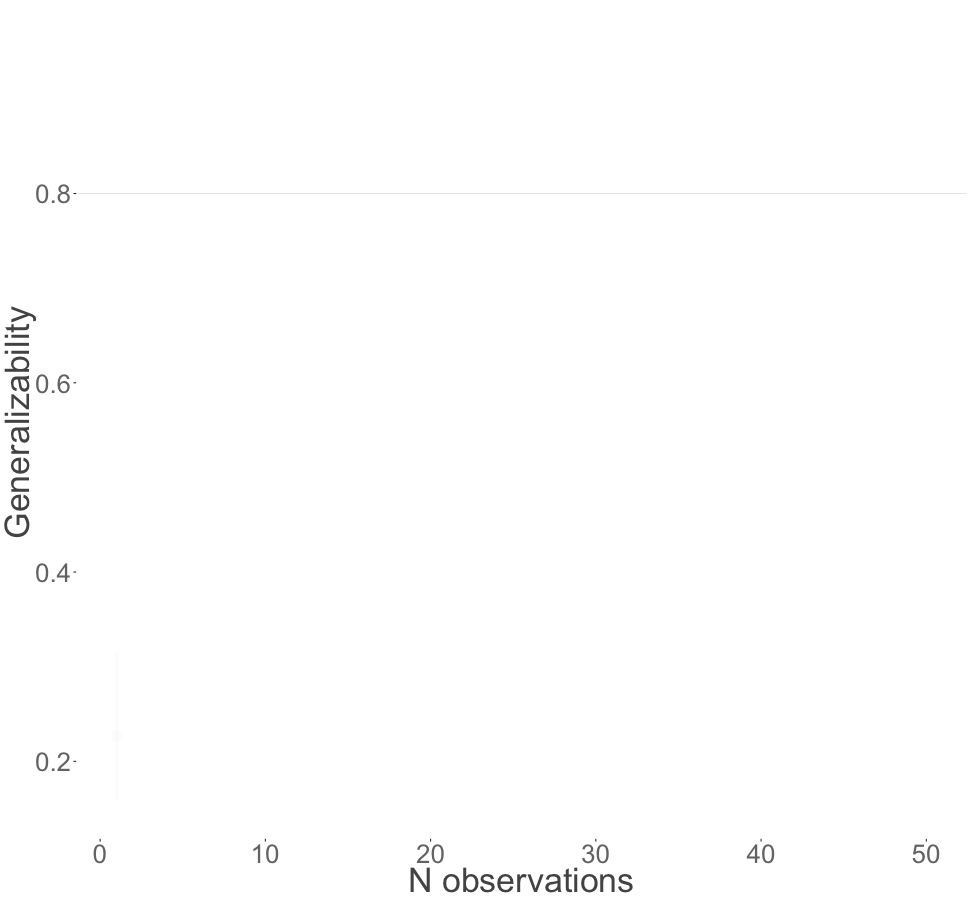

Have you thought about how many ratings we would need to reliably estimate a surgical procedure?

In this paper, we used a decision(D) study determines the number of ratings needed to achieve a suitably high dependability coefficient—usually at least 0.8.

The visualization below demonstrated the number of evaluations to reach 0.8 dependability coefficient. There are three different points

- Upper Confidence Interval reached 0.8
- Mean estimate reached 0.8
- Lower Confidence Interval reached 0.8

